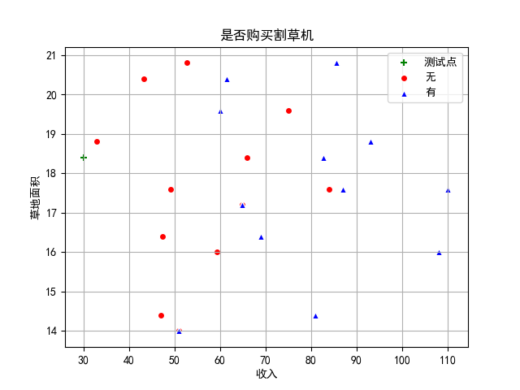
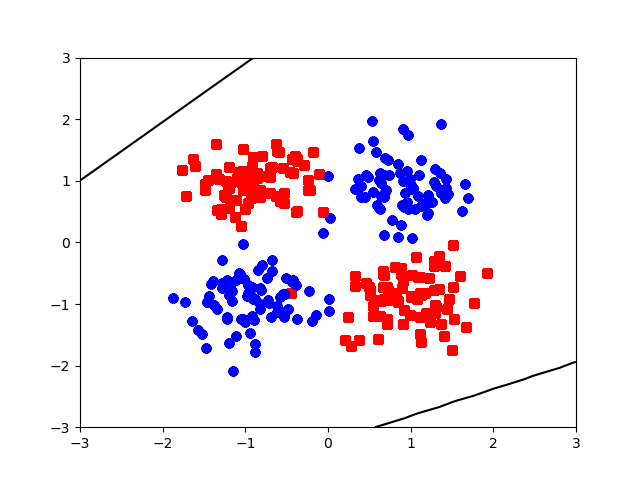
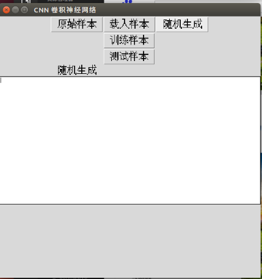
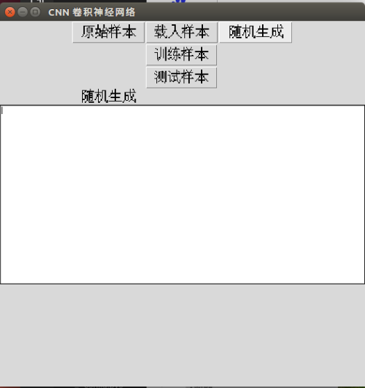
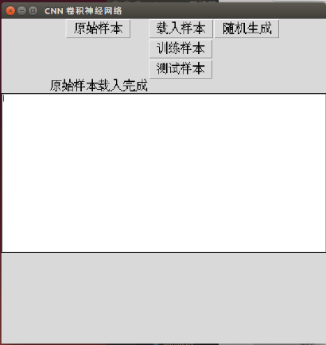
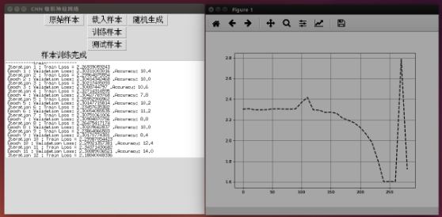
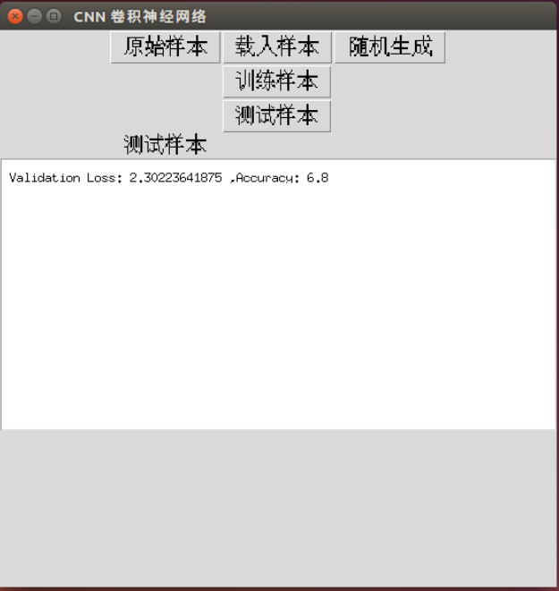

## 机器学习算法学习与实现

### 一、KNNStudy

#### 介绍

KNN 算法实现以及封装

#### Requrements

* Python (>=3.5)

* pandas 

* numpy 

* matplotlib (>=0.18)


#### 理论学习
[KNN 算法理论学习](https://mp.weixin.qq.com/s?__biz=MzAxMTU5Njg4NQ==&mid=100000006&idx=7&sn=f040e0a95376880349378ce7afd634af&chksm=1bbfe43c2cc86d2a5942e0938c871375cffcd72c9795a3e8b39fdb0c8285348631e7bf8a27b4)

#### 算法代码链接
[KNN 算法实现](KNNStudy/KNNClass.py)

#### 算法代码运行效果




### 二、NBStudy

#### 介绍

NB 算法实现以及封装

#### Requrements

* Python (>=3.5)

* collections 

* numpy 


#### 理论学习
[NB 算法理论学习]()

#### 算法代码链接
[NB 算法实现](NBStudy/NBStudy.py)

#### 算法代码运行效果


```python
defaultdict(<class 'int'>, {('Sunny', 'No'): 3, ('Sunny', 'Yes'): 2, ('Cool', 'Yes'): 3, ('Cool', 'No'): 1, ('High', 'No'): 4, ('High', 'Yes'): 3, ('Strong', 'No'): 3, ('Strong', 'Yes'): 3})

-----------calPriorProbability-----------
{'Yes': 0.6428571428571429, 'No': 0.35714285714285715}

-----------calPosteriorProbability-----------
{('Sunny', 'No'): 0.6, ('Sunny', 'Yes'): 0.2222222222222222, ('Cool', 'Yes'): 0.3333333333333333, ('Cool', 'No'): 0.2, ('High', 'No'): 0.8, ('High', 'Yes'): 0.3333333333333333, ('Strong', 'No'): 0.6, ('Strong', 'Yes'): 0.3333333333333333}

---------getArgMax--------
No : 0.02057142857142857

```


### 三、AprioriStudy

#### 介绍

Apriori 算法实现以及封装

#### Requrements

* Python (>=3.5)

#### 理论学习
[Apriori 算法理论学习]()

#### 算法代码链接
[Apriori 算法实现](AprioriStudy/AprioriMyTest.py)

#### 算法代码运行效果


```python
L[ 0 ]: {frozenset({'l4'}), frozenset({'l3'}), frozenset({'l5'}), frozenset({'l1'}), frozenset({'l2'})}
freq_set: frozenset({'l4'})
freq_set: frozenset({'l3'})
freq_set: frozenset({'l5'})
freq_set: frozenset({'l1'})
freq_set: frozenset({'l2'})
L[ 1 ]: {frozenset({'l5', 'l1'}), frozenset({'l2', 'l5'}), frozenset({'l2', 'l4'}), frozenset({'l1', 'l3'}), frozenset({'l2', 'l3'}), frozenset({'l2', 'l1'})}
freq_set: frozenset({'l5', 'l1'})
big_rule: (frozenset({'l1'}), frozenset({'l5'}), 0.3333333333333333)
big_rule: (frozenset({'l5'}), frozenset({'l1'}), 1.0)
freq_set: frozenset({'l2', 'l5'})
big_rule: (frozenset({'l2'}), frozenset({'l5'}), 0.2857142857142857)
big_rule: (frozenset({'l5'}), frozenset({'l2'}), 1.0)
freq_set: frozenset({'l2', 'l4'})
big_rule: (frozenset({'l2'}), frozenset({'l4'}), 0.2857142857142857)
big_rule: (frozenset({'l4'}), frozenset({'l2'}), 1.0)
freq_set: frozenset({'l1', 'l3'})
big_rule: (frozenset({'l1'}), frozenset({'l3'}), 0.6666666666666666)
big_rule: (frozenset({'l3'}), frozenset({'l1'}), 0.6666666666666666)
freq_set: frozenset({'l2', 'l3'})
big_rule: (frozenset({'l2'}), frozenset({'l3'}), 0.5714285714285714)
big_rule: (frozenset({'l3'}), frozenset({'l2'}), 0.6666666666666666)
freq_set: frozenset({'l2', 'l1'})
big_rule: (frozenset({'l2'}), frozenset({'l1'}), 0.5714285714285714)
big_rule: (frozenset({'l1'}), frozenset({'l2'}), 0.6666666666666666)
L[ 2 ]: {frozenset({'l2', 'l5', 'l1'}), frozenset({'l2', 'l1', 'l3'})}
freq_set: frozenset({'l2', 'l5', 'l1'})
big_rule: (frozenset({'l2', 'l1'}), frozenset({'l5'}), 0.5)
big_rule: (frozenset({'l2', 'l5'}), frozenset({'l1'}), 1.0)
big_rule: (frozenset({'l5', 'l1'}), frozenset({'l2'}), 1.0)
big_rule: (frozenset({'l2'}), frozenset({'l5', 'l1'}), 0.2857142857142857)
big_rule: (frozenset({'l1'}), frozenset({'l2', 'l5'}), 0.3333333333333333)
big_rule: (frozenset({'l5'}), frozenset({'l2', 'l1'}), 1.0)
freq_set: frozenset({'l2', 'l1', 'l3'})
big_rule: (frozenset({'l2', 'l1'}), frozenset({'l3'}), 0.5)
big_rule: (frozenset({'l2', 'l3'}), frozenset({'l1'}), 0.5)
big_rule: (frozenset({'l1', 'l3'}), frozenset({'l2'}), 0.5)
big_rule: (frozenset({'l2'}), frozenset({'l1', 'l3'}), 0.2857142857142857)
big_rule: (frozenset({'l1'}), frozenset({'l2', 'l3'}), 0.3333333333333333)
big_rule: (frozenset({'l3'}), frozenset({'l2', 'l1'}), 0.3333333333333333)

```


### 四、GradientDescentStudy

#### 介绍

GradientDescent 算法实现以及封装

#### Requrements

* Python (>=3.5)

* numpy 

* matplotlib (>=0.18)

#### 理论学习
[GradientDescent 算法理论学习]()

#### 算法代码链接
[GradientDescent 算法实现](GradientDescentStudy/GradientDescentTest.py)


### 五、RandomForest

#### 介绍

RandomForest 算法实现以及封装

#### 数据集介绍

编写爬虫抓取携程网酒店住房数据，数据类型如下：

name              | decs
:----             | :----
hotelClass          |  酒店级别
hotelLowestprice      |  最低价格
hotelComment         |  酒店
healthScore         |  卫生分数
surroundingsScore     |  环境分数
serviceScore        |  服务分数
facilityScore        |  
userRecommended       |  

#### Requrements

* Python (>=3.5)

* numpy 

* matplotlib (>=0.18)

* pandas 

* sklearn 

* logging 

#### 理论学习
[RandomForest 算法理论学习](https://mp.weixin.qq.com/s?__biz=MzAxMTU5Njg4NQ==&mid=100001388&idx=1&sn=21bae727bf3510fad98b3ec4a89d124e&chksm=1bbfe3562cc86a40769ea726f96e3a45185697f9582a2e3fbbbeec3af90dd722ebe09b635ddc&scene=20&xtrack=1#rd)

#### 算法代码链接
[RandomForest 算法实现](RandomForest/xiechengRF/RandomForestClass.py)

[基于PCA 的 RandomForest 算法实现](RandomForest/xiechengRF/xiechengPCARF.py)


### 六、SVN

#### 介绍

SVN 算法实现以及封装

#### 数据集介绍

编写爬虫抓取携程网酒店住房数据，数据类型如下：

name              | decs
:----             | :----
hotelClass          |  酒店级别
hotelLowestprice      |  最低价格
hotelComment         |  酒店
healthScore         |  卫生分数
surroundingsScore     |  环境分数
serviceScore        |  服务分数
facilityScore        |  
userRecommended       |  

#### Requrements

* Python (>=3.5)

* numpy 

* matplotlib (>=0.18)

* pandas 

* sklearn 

* logging 

#### 理论学习

[SVN 算法理论学习](https://mp.weixin.qq.com/s?__biz=MzAxMTU5Njg4NQ==&mid=100001388&idx=1&sn=21bae727bf3510fad98b3ec4a89d124e&chksm=1bbfe3562cc86a40769ea726f96e3a45185697f9582a2e3fbbbeec3af90dd722ebe09b635ddc&scene=20&xtrack=1#rd)

#### 算法代码链接

[PCA 算法降维](SVN/PCAandXiecheng.py)

[SVN 算法实现](SVN/PCAandSVN.py)


### 七、BPNN

#### 介绍

BPNN 算法实现以及封装


#### Requrements

* Python (>=3.5)

* numpy 

* matplotlib (>=0.18)


#### 理论学习

[BPNN 算法理论学习]()

#### 算法代码链接


[BPNN 算法实现](ANN/BP/test.py)


#### 算法代码运行效果



```python
[[131.37436821  89.80489322  93.62128778 120.81983405 195.11064689]]
[[  3.41589617  -7.81790557 -24.81536717]
 [  1.42394945  -8.93950953 -33.93583834]
 [ -1.09484339  -3.36060313 -16.56460439]
 [  0.6733797   -0.70875915   4.61787133]]
```

### 八、PCA

#### 介绍

PCA 算法实现以及封装


#### Requrements

* Python (>=3.5)

* numpy 

* matplotlib (>=0.18)


#### 理论学习

[PCA 算法理论学习]()

#### 算法代码链接


[PCA 算法实现](DimensionalityReduction/PCA/PCAClass.py)


### 九、CNN numpy 实现

#### 介绍

CNN 算法实现以及封装


#### Requrements

* Python (>=3.5)

* numpy 

* matplotlib (>=0.18)

* Tkinter


#### 理论学习

[卷积运算的定义、动机](https://mp.weixin.qq.com/s?__biz=MzAxMTU5Njg4NQ==&mid=100000973&idx=2&sn=4eced9e7204274a4e3798cb73a140c72&chksm=1bbfe1f72cc868e1f63262fad39b4f735a6d424c064f6bee755e438b94487bf75b5d41cc02c0&scene=20&xtrack=1&key=fe048f5ad4fa1bcff1ed72e320faab18cb01c02c1a16279c60775734b428e42206e9f5a8f3c402ae96c01259df639ca04206da43e2ab1b42bfaf44bb4068c793df27faa893ea0301a375086e4adfd3b7&ascene=1&uin=MjQ3NDIwNTMxNw%3D%3D&devicetype=Windows+10&version=62060426&lang=zh_CN&pass_ticket=906xy%2Fk9TQJp5jnyekYc89wLa17ODmZRkas9HXdX%2BtYcy0q32NIxLHOhFx519Yxa)

[反卷积Deconvolution](https://mp.weixin.qq.com/s?__biz=MzAxMTU5Njg4NQ==&mid=100000973&idx=3&sn=8a787cc0e165fa071ca7a602f16fae17&chksm=1bbfe1f72cc868e1249a3ebe90021e2a6e12c3d8021fcc1877a5390eed36f5a8a6698eb65216&scene=20&xtrack=1#rd)

[池化运算的定义](https://mp.weixin.qq.com/s?__biz=MzAxMTU5Njg4NQ==&mid=100000973&idx=4&sn=cebf71790dd7e0e497fa36fa199c368d&chksm=1bbfe1f72cc868e1017d26a996f1eb7602fad1efced62713def3012b8df1b85b6ba46c0ebae8&scene=20&xtrack=1#rd)

#### 算法代码链接

[CNN 算法实现](CNN-Numpy_suss/view.py)

#### 运行效果











### 十、Softmax numpy 实现

#### 介绍

Softmax 在机器学习和深度学习中有着非常广泛的应用。尤其在处理多分类（C > 2）问题，分类器最后的输出单元需要Softmax 函数进行数值处理。关于Softmax 函数的定义如下所示：


其中，Vi 是分类器前级输出单元的输出。i 表示类别索引，总的类别个数为 C。Si 表示的是当前元素的指数与所有元素指数和的比值。Softmax 将多分类的输出数值转化为相对概率，更容易理解和比较。我们来看下面这个例子。

一个多分类问题，C = 4。线性分类器模型最后输出层包含了四个输出值，分别是：


经过Softmax处理后，数值转化为相对概率：


很明显，Softmax 的输出表征了不同类别之间的相对概率。我们可以清晰地看出，S1 = 0.8390，对应的概率最大，则更清晰地可以判断预测为第1类的可能性更大。Softmax 将连续数值转化成相对概率，更有利于我们理解。

实际应用中，使用 Softmax 需要注意数值溢出的问题。因为有指数运算，如果 V 数值很大，经过指数运算后的数值往往可能有溢出的可能。所以，需要对 V 进行一些数值处理：即 V 中的每个元素减去 V 中的最大值。


#### Requrements

* Python (>=3.5)

* numpy 


#### 理论学习

[Softmax 理论学习](https://mp.weixin.qq.com/s?__biz=MzAxMTU5Njg4NQ==&mid=100001925&idx=5&sn=20c5ead4f4b5f8f88c30043fb3703557&chksm=1bbfedbf2cc864a96b5fc4575e09294478f6f4cff65d654b8d775fed78766f80faf333d8ca08&scene=20&xtrack=1#rd)


#### 算法代码链接

[Softmax 算法实现](softmaxStudy/softmaxStudy.py)

#### 运行效果
